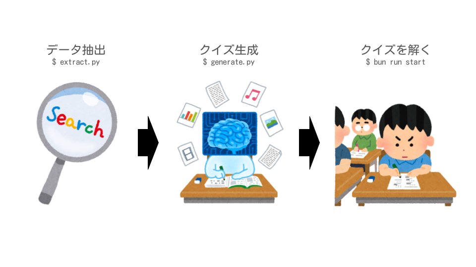

# 企業クイズ生成システム

指定した企業についての情報を収集し、そこからクイズを出題します。

AIがWeb Search & クイズを作っています。コーディングも所謂Vibe Codingで作りました。

## 全体像




## 主な機能

### 📊 データ抽出システム（extract.py）
- **Webサーチ**: OpenAI GPT-5 + Web検索で最新企業情報を自動収集
- **自動整理**: 会社別・カテゴリ別の構造化されたナレッジベース構築
- **対話/引数モード**: 柔軟な実行方式（対話的選択 or コマンドライン引数）

### 🤔 クイズ生成システム(generate.py)
- **クイズ生成** OpenAI GPT-5によるデータ抽出結果からクイズを生成

### 🎯 クイズアプリケーション（Next.js + React）
- **3段階選択**: 会社 → 大カテゴリ → 中カテゴリ
- **5問4択クイズ**: 1つの文書から統一感のある5問を生成
- **「すべて」選択**: ランダムな出題で偏りのない学習
- **参考URL表示**: 情報源の確認が可能
- **データ抽出との連携**: 抽出したデータをもとにクイズを生成

## データ構造

抽出したデータと生成したクイズは以下のように配置されます。

```
knowledge_base or quizzes/
└── {会社名}/
    ├── business/      # ビジネス情報
    │   ├── competition/    # 競合分析
    │   ├── market/        # 市場情報
    │   └── pricing/       # 価格戦略
    ├── culture/       # 企業文化
    ├── history/       # 企業史
    ├── people/        # 人事・組織
    └── products/      # 製品・サービス
        ├── saas/
        ├── enterprise/
        └── consumer/
```


### 柔軟なカテゴリ構成
- **標準カテゴリ**: 新会社作成時に汎用的な構造を自動生成
- **カスタマイズ自由**: 各カテゴリに独自のサブフォルダを追加可能
- **動的検出**: `.md`ファイルが存在するフォルダのみ選択肢として表示

## セットアップ

### 必要な環境
- **Python 3.11+**
- **Node.js 18+**
- **Bun**（推奨）またはnpm/yarn
- **OpenAI API キー**

### 1. 環境変数設定

### .envファイル

```bash
# ルートディレクトリ
cp .env.example .env
```

`.env`ファイルを編集：
```env
OPENAI_API_KEY=your_openai_api_key_here
COMPANY_NAME=デフォルト会社名（オプション）
```
#### direnvを使用

```bash
cp .envrc.example .envrc
```

direnvをインストール：
```bash
sudo apt-get install direnv
```

シェルにdirenvを設定：
```bash
# bashの場合
echo 'eval "$(direnv hook bash)"' >> ~/.bashrc
```

シェルを再起動後、環境変数を設定：
```bash
direnv allow
```

## 使用方法

### 📝 データ抽出

#### Python環境セットアップ
```bash
# 依存関係インストール
uv sync
```

#### 実行方法

**対話モード**（推奨）
```bash
python extract.py
# 会社名、カテゴリ、サブカテゴリを順次選択
```

**引数モード**（自動化用）
```bash
# 特定の情報を直接指定
python extract.py --company "会社名" --category "business" --subcategory "market"
```

### 🧠クイズ生成

**対話モード**（推奨）
```bash
python generate.py
# 会社名、カテゴリ、サブカテゴリ、対象文書を順次選択
```

**引数モード**（自動化用）
```bash
# 特定の情報を直接指定
python generate.py --company "会社名" --category "business" --subcategory "market" --file "YYYYMMDD_hhmmss.json"
```

### 🎮 クイズアプリ

#### フロントエンド環境セットアップ
```bash
cd quiz-frontend

# 依存関係インストール
bun install
```

#### アプリ起動
```bash
# 開発サーバー起動
bun run dev -p 3000

# 本番の場合は以下
bun run build
bun start -p 3000
```

http://localhost:3000 でクイズアプリにアクセス

## 詳細オプション

### 環境変数での会社名設定
```env
# .envに設定すると対話モードで自動選択
COMPANY_NAME=xxxxxx株式会社
```

### カスタムカテゴリ追加
```bash
# 例：独自のサブカテゴリ作成
mkdir -p knowledge_base/会社名/products/新製品カテゴリ
# extract.pyで「新製品カテゴリ」が選択肢に自動追加
```

### 「すべて」モードの活用
- **カテゴリ「すべて」**: 全カテゴリからランダム出題
- **サブカテゴリ「すべて」**: 指定カテゴリ内からランダム出題
- **両方「すべて」**: 全データからランダム出題

## トラブルシューティング

### OpenAI APIエラー
- API キーが正しく設定されているか確認
- GPT-5へのアクセス権限があるか確認

### データが表示されない
- `.md`ファイルが正しいフォルダに配置されているか確認
- フォルダ構造が`knowledge_base/会社名/カテゴリ/サブカテゴリ/`になっているか確認
